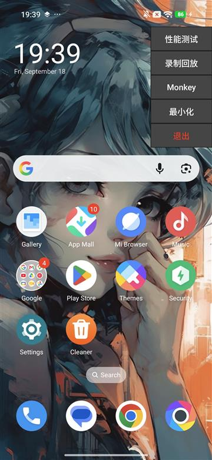
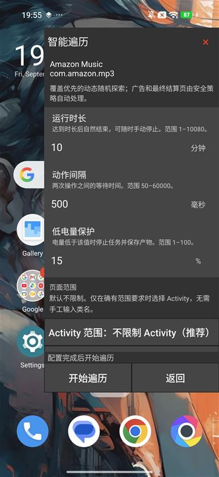
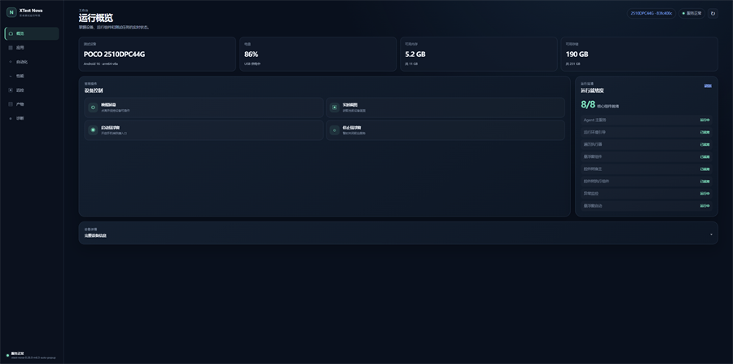
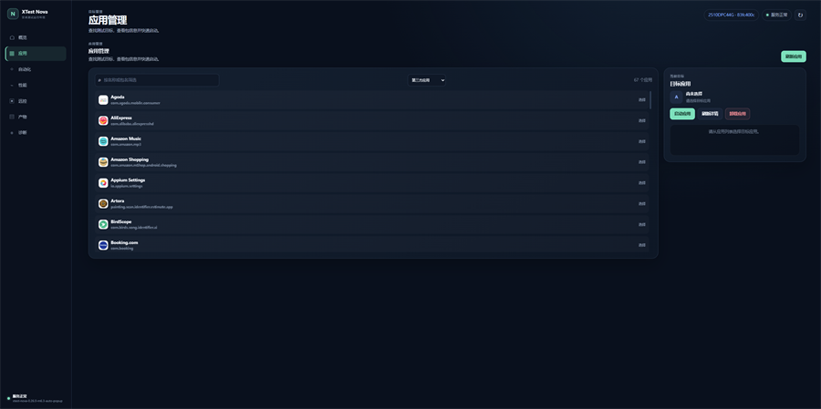
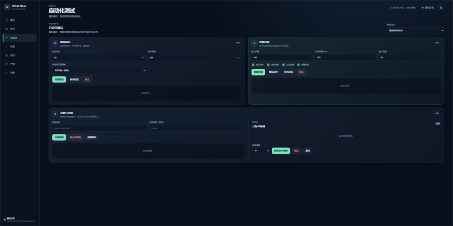
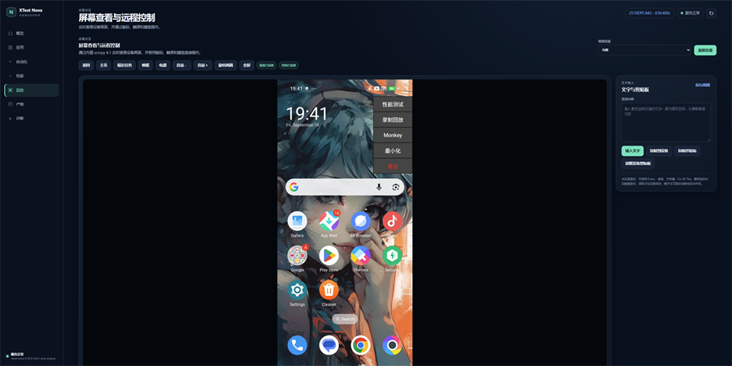
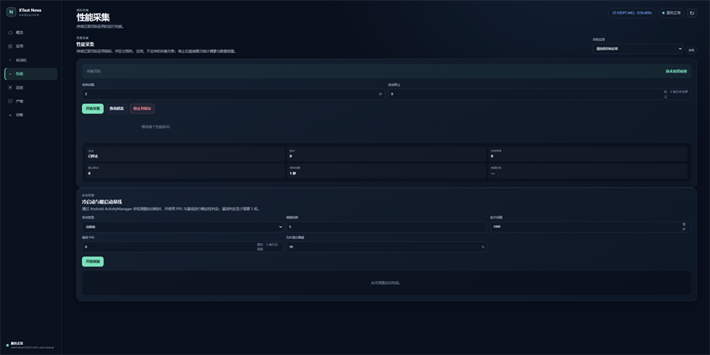
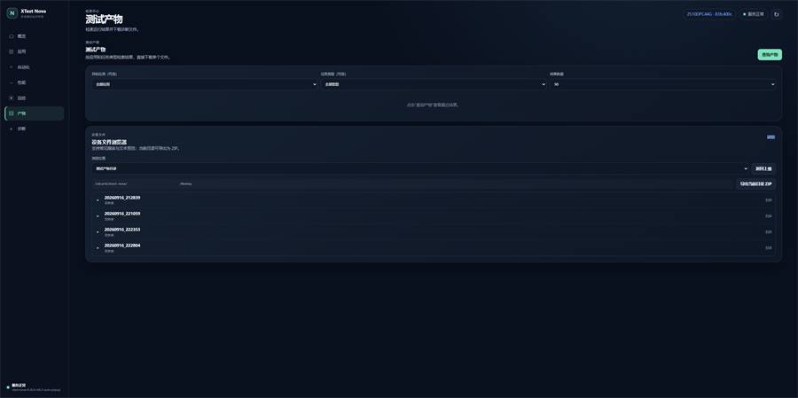
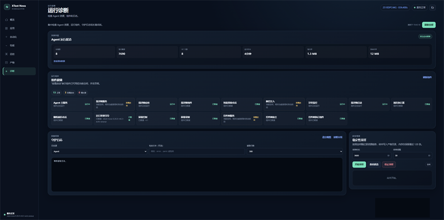

<div align="center">


# XTest Nova

**运行在手机上的智能自动化测试工具**

[](https://go.dev/)
[](https://openjdk.org/)
[](https://github.com/Genymobile/scrcpy)
[](LICENSE)

[中文](README.md) · [English](README_en.md)

[功能特性](#功能特性) · [系统架构](#系统架构) · [快速开始](#快速开始) · [界面预览](#界面预览) · [文档](#文档)

</div>

## 项目简介

XTest Nova 把探索、Monkey、录制回放、性能采集和远程控制放在手机上的一个 Agent 里。推送到设备后，用浏览器或 API 操作即可；截图、日志和性能数据按目标应用保存在设备上。

一台设备对应一个 Agent。默认通过本机 ADB 转发访问，局域网直连需按文档开启认证。

## 界面预览

真机上的设备端悬浮窗与 Web 控制台。

<div align="center">

**设备端**

 

**Web 控制台**

运行概览



应用管理



自动化测试



设备远控



性能采集



测试产物



运行诊断



</div>

## 功能特性

**自动化执行**

- 智能探索：基于页面控件树识别可点击、可滚动和可输入节点，维护场景状态图，支持返回回溯和已知路径回放。
- Monkey：按目标应用启动结构化随机遍历，支持时长、节流、低电量退出和停止后产物收尾。
- 录制回放：记录触控、输入和手势，按标准化坐标回放，并给出通过 / 失败 / 未测判定。
- 设备端悬浮窗：在手机上直接选择目标应用、调整参数并启停任务，不必回到电脑。

**设备、应用与远程控制**

- 应用安装、启动、停止、卸载，以及设备文件的上传、下载和目录浏览。
- 内置 Web 控制台：实时画面、鼠标 / 触屏、键盘、旋转、截图和剪贴板，离开页面后自动断开。
- 基于官方 scrcpy 4.1 的画面与控制通道，供控制台和自动化任务共用。

**性能与产物**

- 采集目标应用的 CPU、内存、帧率、卡顿、GPU、网络和电池数据，并生成会话摘要。
- 支持冷启动 / 暖启动多轮统计，输出 P50、P90、P95 等指标。
- 每次运行在 `/sdcard/xtest-nova/<应用包名>/` 下保存事件、截图、诊断和证据索引，停止任务不会丢掉收尾中的产物。

**接口与交付**

- 浏览器控制台与版本化 `/v1/*` API 并行提供，便于接入现有测试平台。
- 按设备架构发布单个 Agent 文件，启动时自动释放并安装 Runner、Companion 和 UiAutomator。
- 默认仅监听设备回环地址；局域网访问需要令牌，高风险命令接口默认关闭。

完整接口清单、兼容范围和限制见 [HTTP 合同](docs/compliance/http-contract.md) 与 [兼容矩阵](docs/compliance/compatibility.md)。

## 系统架构

```text
浏览器 / API 客户端
        |
        | HTTP / WebSocket（默认经 adb forward）
        v
Nova Agent（设备端 :7912）
  |-- Web 控制台与 HTTP API
  |-- 应用、文件、性能、录制回放、诊断与产物
  |-- Monkey / 探索 / scrcpy 会话管理
        |
        +-- Runner：控件探索与输入执行
        +-- Companion：悬浮窗与设备端配置（:8912）
        +-- UiAutomator：控件树采集
        +-- scrcpy server 4.1：画面与控制
```

正式发布提供 ARM64 和 ARMv7 两份 Agent。部署时只推送当前设备对应的一份文件；Agent 启动后自行校验并安装其余组件。验证用样例应用不会打进运行时，也不会被自动安装。

组件职责：

| 组件          | 作用                      |
|-------------|-------------------------|
| Agent       | 设备端服务入口，负责 API、会话、安全和产物 |
| Runner      | 在设备上执行探索、点击、滑动和按键       |
| Companion   | 悬浮窗、权限与设备端参数            |
| UiAutomator | 提供控件树，供探索和录制识别页面        |

## 快速开始

### 环境要求

- Windows PowerShell
- Go 1.25.0
- JDK 21
- Android SDK Platform 36、Build Tools 36.0.0
- 已开启 USB 调试的 Android 设备，以及可用的 `adb`

工具链版本见 [`tools/build-toolchain.psd1`](tools/build-toolchain.psd1)。仓库已包含 Gradle Wrapper，无需单独安装 Gradle。

### 构建

开发构建（只编译 Runner 和开发版 Agent，复用仓库中已有的签名运行时）：

```powershell
.\build.ps1 -Development
```

正式发布构建需要仓库外的签名证书：

```powershell
$storePassword = Read-Host 'Keystore password' -AsSecureString
$keyPassword = Read-Host 'Key password' -AsSecureString
.\build.ps1 -KeyStore D:\secure\xtest-recovery-signing.jks -KeyAlias xtest-recovery `
  -StorePassword $storePassword -KeyPassword $keyPassword
```

仅验证 Go Agent：

```powershell
go test ./agent/...
go run ./agent/cmd/xtest-nova-agent
```

仓库级构建与发布检查在 [`scripts/`](scripts/README.md)，真机和端到端测试在 [`tests/`](tests/README.md)。

### 部署

```powershell
.\deploy.ps1 -Serial <设备序列号> -StartServer
```

多台设备分别执行一次即可。未指定本机端口时，ADB 会为每台设备分配互不冲突的转发端口，并打印对应控制台地址。不要把两台设备转发到同一个固定端口。

部署成功后，用电脑浏览器打开打印出的地址，例如 `http://127.0.0.1:7912/`。设备端服务默认只监听回环地址，需要先建立 `adb forward`；使用上面的 `deploy.ps1` 会自动完成转发。

常用设备端命令：

```text
adb shell /data/local/tmp/xtest-nova-agent server -d
adb shell /data/local/tmp/xtest-nova-agent server -d --stop
adb shell /data/local/tmp/xtest-nova-agent monkey status
adb shell /data/local/tmp/xtest-nova-agent monkey stop
adb shell /data/local/tmp/xtest-nova-agent version
```

`server -d` 会补齐组件并显示悬浮窗。`monkey stop` 只结束当前任务，不会关闭 Agent，也不会删除已生成的产物。

### 访问方式

默认地址：

- Agent / Web 控制台：`http://127.0.0.1:7912`
- Companion：`http://127.0.0.1:8912`

默认情况下，7912、8912、7890 都只监听设备回环，通过可信 `adb forward` 访问。若要从局域网直连 7912，需要同时提供令牌文件：

```powershell
$tokenPath = Join-Path $HOME '.xtest-nova-api-token'
.\scripts\new-lan-token.ps1 -OutputPath $tokenPath
.\deploy.ps1 -Serial <设备序列号> -StartServer -AllowLAN -ApiTokenFile $tokenPath
```

LAN 模式只放开 7912，并要求 Bearer 或浏览器登录；8912 和 7890 仍保持回环。令牌至少 32 字节，不要写入仓库，也不要放进 URL。生成、轮换和恢复步骤见 [使用说明](docs/reference/usage.md)。

`/shell`、`/shell/background` 和 `/term` 可以按设备 shell 身份执行任意命令，因此默认关闭。仅在可信环境需要兼容旧客户端时，再显式打开 `--legacy-unsafe-api`。该开关本身不提供认证，也不改变监听地址；与 LAN 模式同时使用时，这些接口同样需要登录。说明见 [`--legacy-unsafe-api` 使用说明](docs/guides/legacy-unsafe-api.md)。

## 文档

日常使用从这里开始：

- [文档总索引](docs/README.md)
- [使用说明](docs/reference/usage.md)
- [系统架构](docs/reference/architecture.md)
- [发布与回滚](docs/reference/release.md)
- [智能探索 API](docs/api/exploration-api.md)
- [Monkey API](docs/api/monkey-api.md)
- [录制回放 API](docs/api/record-replay-api.md)
- [HTTP 合同](docs/compliance/http-contract.md)
- [兼容矩阵](docs/compliance/compatibility.md)

设计决策、实施计划和历史验证记录按主题放在 `docs/` 中，不在本页逐条展开。需要查阅某一期真机结果或整改记录时，从 [文档总索引](docs/README.md) 进入对应分类即可。

## 致谢

感谢 [XTest](https://github.com/y-grey/XTest) 提供的参考与启发。

## 版本与许可证

- [版本变更记录](CHANGELOG.md)
- [项目权利与分发声明](NOTICE.md)
- [第三方软件及许可证清单](THIRD_PARTY_NOTICES.md)
- [MIT 许可证](LICENSE)
